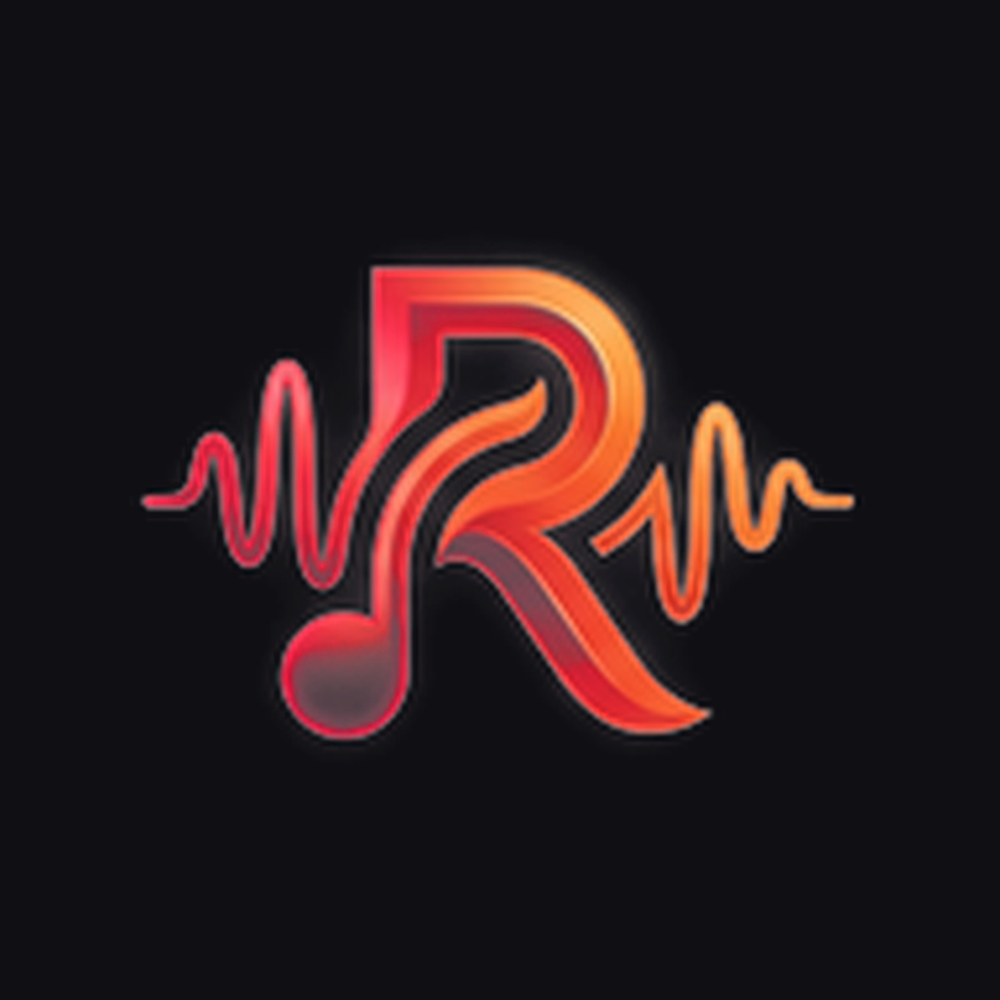

<div align="center">

<br/>



# RaagaX

### Next-Generation, Cross-Platform Music Streaming & Handoff Player

<p align="center">
  <em>An elegant, audiophile-grade music streaming experience crafted with Compose Multiplatform & Kotlin. Seamlessly connects Desktop and Mobile.</em>
</p>

<br/>

[](https://github.com/Astrionix/RaagaX/releases)
[](LICENSE)
[](#-downloads--platforms)
[](https://kotlinlang.org/)

<br/>

[**📥 Downloads**](#-downloads--platforms) &nbsp;•&nbsp; 
[**✨ Key Features**](#-key-features) &nbsp;•&nbsp; 
[**🔄 Raaga Connect**](#-raaga-connect) &nbsp;•&nbsp; 
[**🛠️ Build from Source**](#-build-from-source) &nbsp;•&nbsp; 
[**🤝 Contributing**](#-contributing) &nbsp;•&nbsp; 
[**⚖️ Legal Notice**](#-disclaimer--legal-notice)

<br/>

</div>

> [!IMPORTANT]
> **RaagaX** is an independent, community-driven client built for personal research and educational purposes. It is not affiliated with, endorsed by, or sponsored by Google LLC, YouTube, or Spotify.

---

## ✨ Key Features

<table>
  <tr>
    <td width="50%" valign="top">

### 🎧 Audiophile Playback
- **Lossless & Hi-Res Audio:** Bit-perfect streaming up to 24-bit / 192 kHz (FLAC & ALAC) with YouTube Music audio fallback.
- **True Gapless & Crossfade:** Adjustable 0–12s crossfade curves with zero clipping or silence between tracks.
- **Automix [Beta]:** Intelligent beat-matching and tempo alignment for effortless, DJ-like continuous mixes.
- **Silence Skipping & Speed Control:** Precise variable playback speed (0.5×–2.0×) and silence removal.
- **Offline Music:** Download tracks locally with high-resolution artwork and embedded ID3 tags.
- **Local Audio Library:** Scan and seamlessly mix your local file collections into your streaming queue.

    </td>
    <td width="50%" valign="top">

### 🎨 Visuals & Aesthetics
- **Apple-Inspired Syllable Lyrics:** Word-by-word synchronized lyrics with smooth kinetic glow, blur animations, and romanized script support.
- **Artwork-Driven Fluid Theming:** Dynamic color palettes extracted directly from album covers with vibrant gradient backgrounds.
- **Frosted-Glass Glassmorphism:** Translucent navigation panels and floating playback sheets powered by Haze.
- **Animated Motion Canvas:** Live motion canvas playback background on supported tracks.
- **Stats for Nerds:** Real-time stream telemetry including codec, bitrate, sample rate, bit depth, and buffer status.

    </td>
  </tr>
  <tr>
    <td width="50%" valign="top">

### 🔄 Raaga Connect Ecosystem
- **Spotify Connect-Style Handoff:** Seamlessly transfer active playback between Desktop, Android, and Web devices.
- **Zero Loss Quality:** Target devices stream directly from source rather than compressing audio over Bluetooth.
- **Universal Remote Control:** Pause, resume, skip tracks, adjust volume, or seek playback remotely from any connected device.
- **Local LAN + Supabase Cloud Relay:** Instant low-latency discovery on your local Wi-Fi, paired with secure cloud relay across networks.

    </td>
    <td width="50%" valign="top">

### 🌐 Boundless Integrations
- **Spotify Integration:** Connect your Spotify account to import Liked Songs, playlists, and albums directly into RaagaX.
- **Discord Rich Presence:** Real-time presence showing your current track, artist, album art, and progress bar in Discord.
- **Multi-Source Scrobbling:** Automatic scrobbling to Last.fm and ListenBrainz.
- **Pluggable Audio Sources:** Extensible module pipeline allowing custom API sources with built-in health checking.

    </td>
  </tr>
</table>

---

## 📥 Downloads & Platforms

Every desktop package includes its own isolated Java runtime, native FFmpeg codecs, and Automix libraries. **No JDK or third-party dependencies are required.**

| Operating System | Architecture | Package Format | Download Links |
| :--- | :--- | :--- | :--- |
| **🪟 Windows** | `x64` | Installer (`.exe`), MSI (`.msi`), Portable (`.zip`) | [Windows Releases](https://github.com/Astrionix/RaagaX/releases) |
| **🍎 macOS** | `Apple Silicon (M1-M4)` | Disk Image (`.dmg`), Installer (`.pkg`) | [macOS ARM64](https://github.com/Astrionix/RaagaX/releases) |
| **🍎 macOS** | `Intel (x64)` | Disk Image (`.dmg`), Installer (`.pkg`) | [macOS x64](https://github.com/Astrionix/RaagaX/releases) |
| **🐧 Linux** | `x86_64` | AppImage (`.AppImage`), Debian (`.deb`), RedHat (`.rpm`) | [Linux Releases](https://github.com/Astrionix/RaagaX/releases) |
| **📱 Android** | `arm64-v8a / universal` | Signed Application Package (`.apk`) | [Android Releases](https://github.com/Astrionix/RaagaX/releases) |

> [!TIP]
> **macOS Gatekeeper:** If macOS warns about an unidentified developer on manually downloaded builds, remove the quarantine attribute by running:  
> `xattr -cr /Applications/Raaga.app`

---

## 🔄 Raaga Connect

Raaga Connect provides true cross-device synchronization without compromising on acoustic fidelity:

```
┌────────────────────────┐                   ┌────────────────────────┐
│     Mobile Phone       │  Remote Control   │      Desktop App       │
│  (Controller / Client) │ ────────────────> │    (Receiver / Hi-Fi)  │
└────────────────────────┘  HTTP / WebSocket └────────────────────────┘
            ▲                                             │
            │                                             │ Direct Stream
            └──────────── Supabase Cloud Relay ───────────┘ (Bit-Perfect FLAC)
```

1. **Tap the Connect Device icon** on your now-playing bar.
2. Select your nearby Desktop or Mobile device discovered over local Wi-Fi or signed-in cloud account.
3. Your music seamlessly transfers position and state instantly, while your phone functions as a responsive remote control.

---

## 🛠️ Build from Source

### Prerequisites
- **JDK 21 or newer** ([Eclipse Temurin 21](https://adoptium.net/) recommended)
- **Git**

### Clone & Build Desktop Application

```bash
# Clone the repository and switch to desktop branch
git clone https://github.com/Astrionix/RaagaX.git
cd RaagaX
git checkout desktop

# Run the Desktop Application
./gradlew :desktopApp:run
```

### Packaging Self-Contained Installers

```bash
# Windows: Build standalone installer (.exe)
./gradlew :desktopApp:packageExe

# macOS: Build disk image installer (.dmg)
./gradlew :desktopApp:packageDmg

# Linux: Build Debian (.deb) or RedHat (.rpm) packages
./gradlew :desktopApp:packageDeb
./gradlew :desktopApp:packageRpm
```

For comprehensive platform-specific compilation instructions, refer to [DESKTOP.md](DESKTOP.md).

---

## 🤝 Contributing

Contributions, feature proposals, and bug reports are warmly welcome!

1. Fork the repository.
2. Create your feature branch (`git checkout -b feat/amazing-feature`).
3. Commit your changes (`git commit -m 'feat: add amazing feature'`).
4. Push to the branch (`git push origin feat/amazing-feature`).
5. Open a Pull Request.

Please check out our [Contributing Guide](CONTRIBUTING.md) and [Code of Conduct](CODE_OF_CONDUCT.md) before submitting code.

---

## ⚖️ Disclaimer & Legal Notice

RaagaX is an independent, community-driven third-party audio player and client. It is **not** associated with or endorsed by Google LLC, YouTube Music, Deezer, Spotify, Telegram, or any of their parent organizations.

- **No Media Hosting:** RaagaX does not host, upload, or store copyrighted music files. It operates strictly as a client interface to play local device storage or stream media directly from public, user-authorized, or authenticated APIs.
- **Fair Use:** This software is provided solely for personal research, educational, and interoperability purposes.
- **Copyleft License:** RaagaX is distributed as free software under the **GNU General Public License v3.0 (GPLv3)**. See [LICENSE](LICENSE) for terms.

<br/>

<div align="center">
  <sub>Crafted with passion for music lovers worldwide.</sub>
</div>
